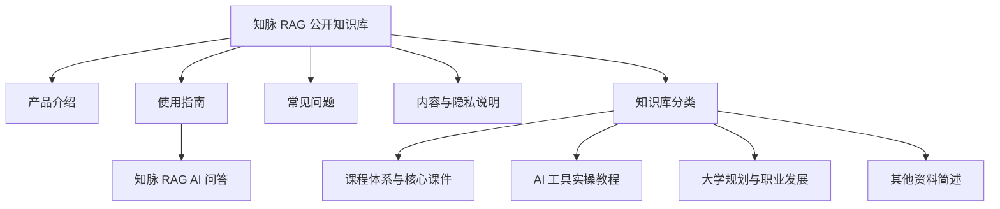

# 全库图谱

> [!tip] 打开交互式全库图谱
> 在电脑端找到页面右侧的“图谱”，点击图谱右上角的展开按钮，即可查看整个知识库。图谱支持拖动、缩放、悬停聚焦和点击节点跳转。

## 知识库总览

## 快速进入

- [[图谱条目/index|51 个独立图谱条目]]
- [[产品介绍]]
- [[使用指南]]
- [[知识库分类/index|知识库分类索引]]
- [[知识库分类/课程体系与核心课件]]
- [[知识库分类/AI工具实操教程|AI 工具实操教程]]
- [[知识库分类/大学规划与职业发展]]
- [[知识库分类/其他已提取文档简述|其他资料简述]]
- [[常见问题]]
- [[内容与隐私说明]]
